# EndNet: Sparse AutoEncoder Network for Endmember Extraction and Hyperspectral Unmixing

* Download datasets from https://drive.google.com/open?id=0B1kqE05deSqxYm8wS1F3UXZYeWM
* Extract datasets.zip to project directory.
* Run demo.m to visualize results for a selected dataset.

Code will be released soon from this page. Stay tuned!...

## Our Results

Samson Data and Abundance Map Results

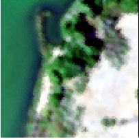

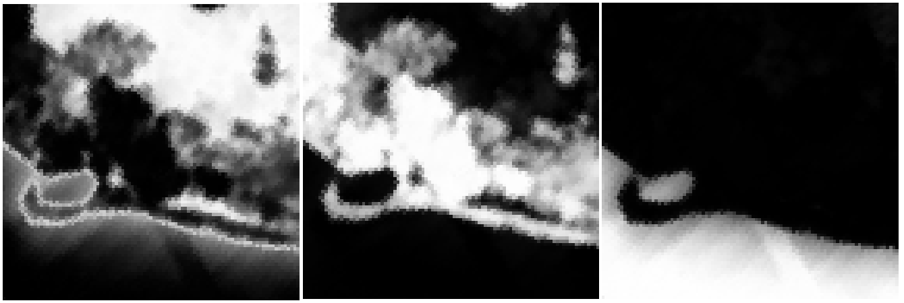

Jasper Data and Abundance Map Results

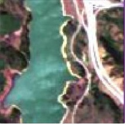

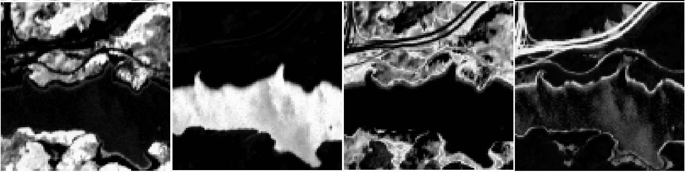

Urban Data and Abundance Map Results

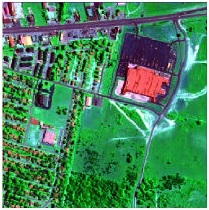


Cuprite Data and Abundance Map Results

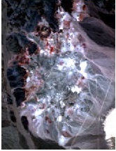

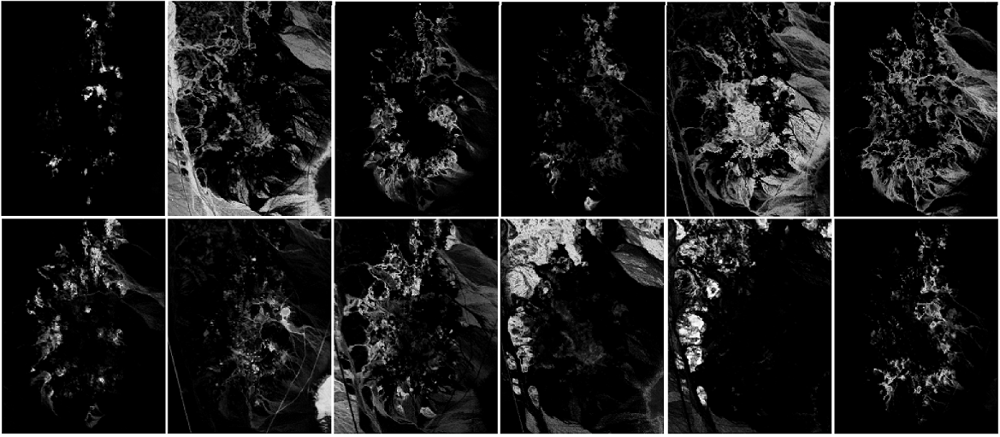

Pavia University Data and Abundance Map Results

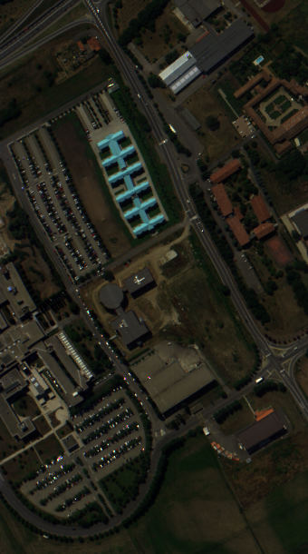

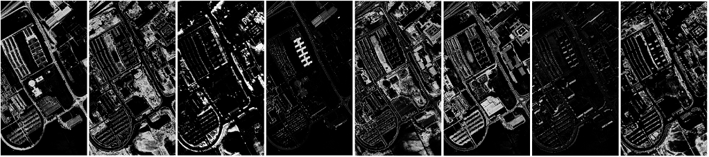

Pavia Center Data and Abundance Map Results

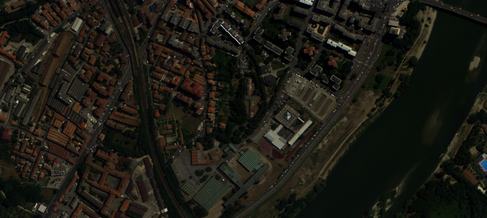

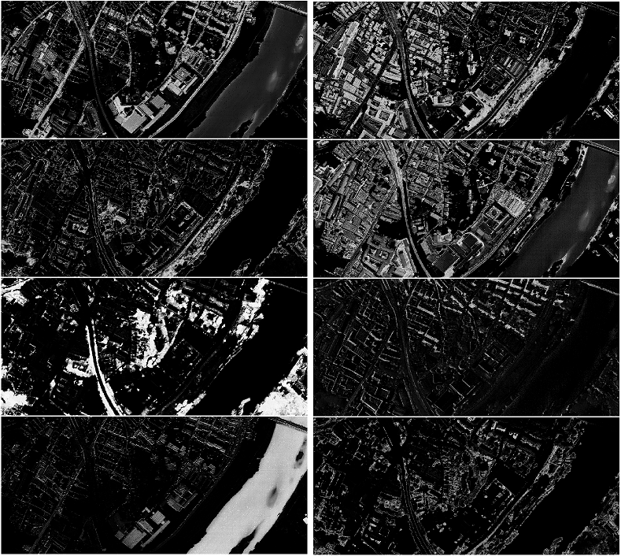

Gulfport Data and Abundance Map Results

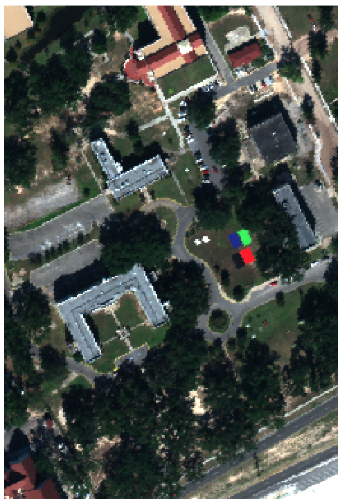

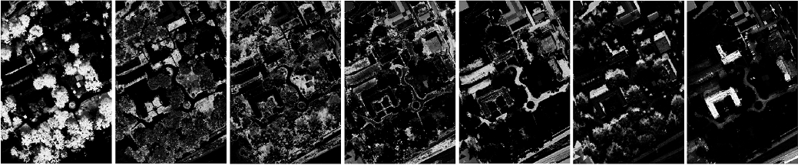

IEEE 2013 Challenge Data and Abundance Map Results

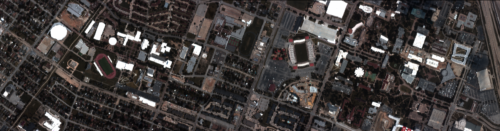

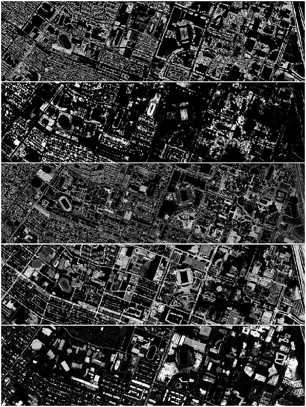

DC Data and Abundance Map Results


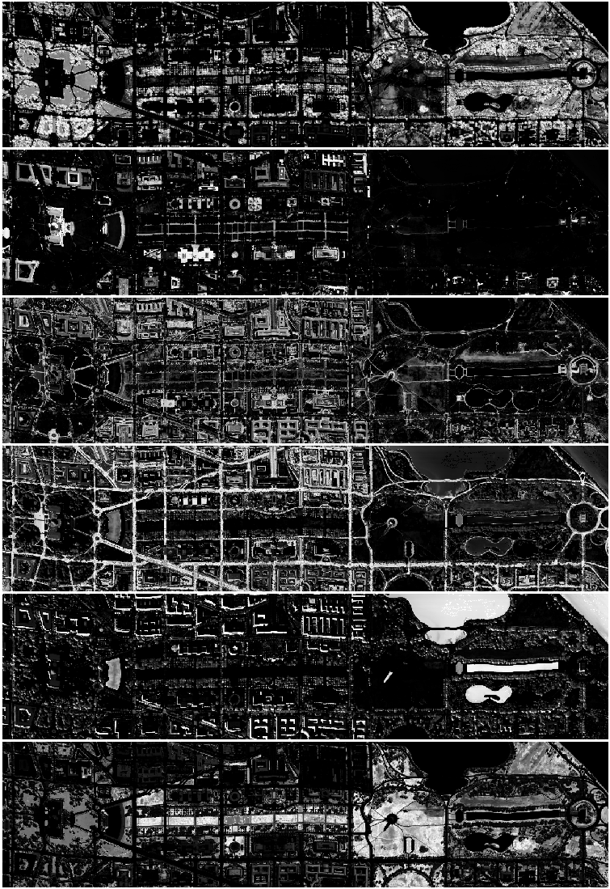

## References

Please cite the following paper:

[1] Savas Ozkan, Berk Kaya, Ersin Esen and Gozde Bozdagi Akar, EndNet: Sparse AutoEncoder Network for Endmember Extraction and Hyperspectral Unmixing, arXiv:1708.01894:
```
@article{ozkan17endnet,
  title={EndNet: Sparse AutoEncoder Network for Endmember Extraction and Hyperspectral Unmixing},
  author={Ozkan, Savas and Kaya, Berk and Esen, Ersin and Akar, Gozde B},
  journal={arXiv:1708.01894},
  year={2017},
}
```
